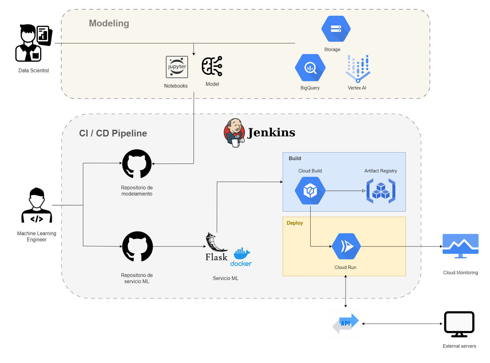
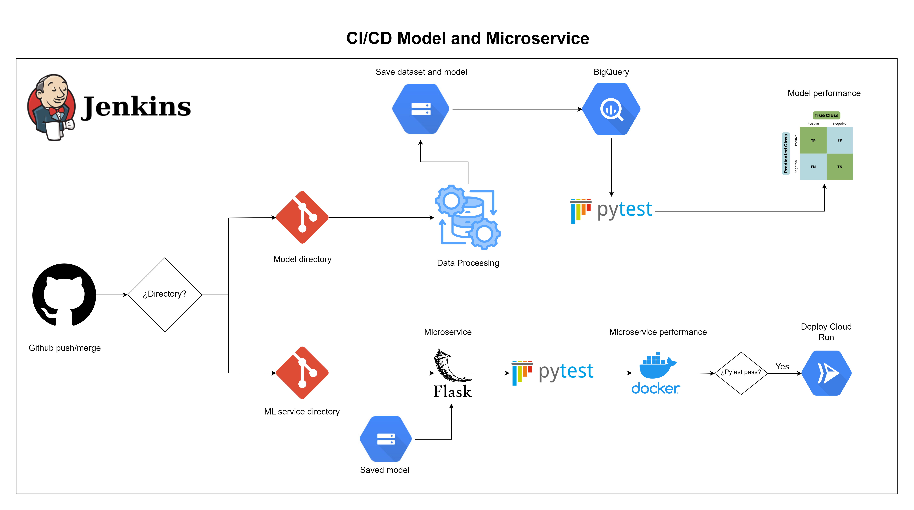

# Proyecto Heart disease MLOps

Este proyecto implementa un pipeline de MLOps para gestionar y automatizar el flujo de trabajo de machine learning, desde la recopilación de datos hasta el despliegue del modelo. La implementación se realiza en GCP.

## Pipeline de CI/CD

A continuación se muestra un diagrama más específico del pipeline de CI/CD utilizado en el repositorio del modelo y del microservicio.

Con ello se asegura la estabilidad y reproducibilidad del modelo bajo un entorno de producción.
